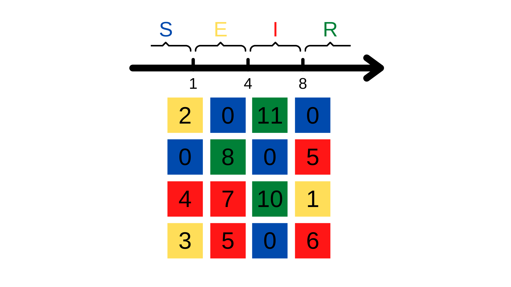
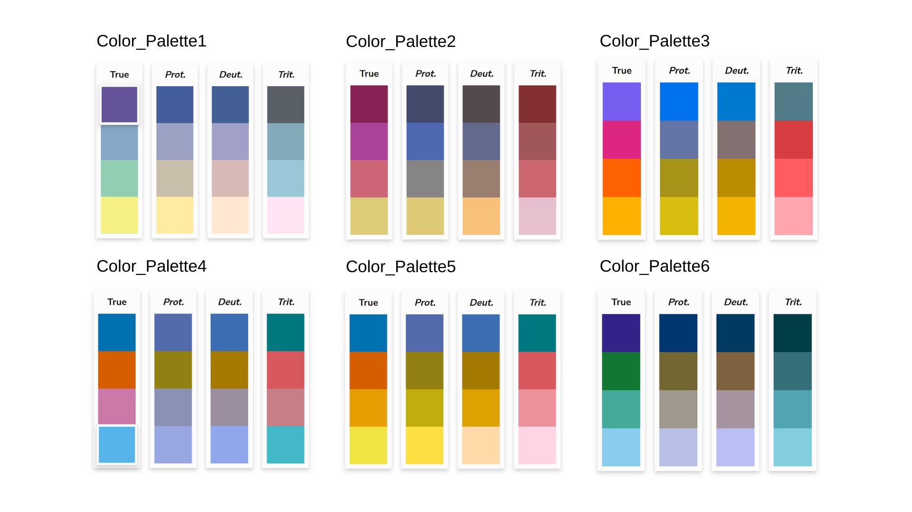

<style type="text/css">
  body{
  text-align: justify;
    font-family: Garamond;
  font-size: 11pt;
  
}
</style>


```{r setup, include=FALSE}
knitr::opts_chunk$set(echo = TRUE)
```


## **Instalar**

```{r, eval=FALSE}
library(devtools)

install_github("Emilio-O/E.Models")
install.packages("plot.matrix")

library(E.Models)
library(plot.matrix)
```

## **Resumen**
2D.Models es una herramienta para visualizar la dispersión de una enfermedad a través del tiempo.
•	SIR() en mantenimiento
•	SEIR()
Las funciones están basadas en los modelos epidemiológicos SIR y SEIR respectivamente, ambas trabajan con una matriz de adyacencias proporcionada por el usuario para modelar la enfermedad deseada en un espacio bidimensional.						

```{r, eval=FALSE}
SEIR(x, Suceptible = 0, Exposed, 
                    Infectious, Recovered, Subject,
                    Days, R0, SavePlots = F,
                    Sag = F, NaDeath = 0, InDeath = 0,
                    Palette = "Color_Palette1")
```

```{r echo = F, results = 'asis'}
library(knitr)
Argumentos <- read.delim("Argumentos.txt", header=T)
kable(Argumentos)
```

## **Detalles**
La función SEIR() hace uso de la librería plot.matrix para realizar plots de cada uno de los días con base en una matriz. Cada casilla de la matriz representa a una persona, a la cual le es asignada un número y es actualizado diariamente. Las poblaciones de susceptibles, expuestos, infectados y recuperados están asociadas a intervalos de números, entonces, si la casilla contiene un número que se encuentre dentro de uno de los cuatro intervalos, reflejará un color que representa dicha población.



La función SEIR() trabaja con cualquier matriz de adyacencia siempre y cuando represente una matriz con el mismo número de filas y columnas. Esto abre la posibilidad a que la matriz de adyacencias represente interacciones semejantes a las que tendría una población en la vida real o simplemente interacciones aleatorias. El R0 con el que trabajará la función está limitado al número de conexiones que tenga una persona con otras y, como parte de la función, una persona puede interactuar más de una vez con la misma persona en el mismo día. La función abre la posibilidad a que el usuario pueda escoger con quién empieza la enfermedad basada en el número de conexiones que tiene.
El usuario puede escoger entre seis diferentes paletas de colores que son amigables para gente con discromatopsia. Se muestra también cómo los colores serían percibidos por una persona sin discromatopsia, con protanopia, deuteranopia o tritanopia.



El usuario tiene la opción de incluir una probabilidad de muerte y una probabilidad de muerte incrementada por la enfermedad. Si una persona muere, el valor de la casilla será reemplazado por un NA, y en el plot se verá reflejado como una casilla de color negro (el color puede ser modificado dentro de la función). Al estar muerta la persona, no tendrá interacción con el resto y no podrá transmitir la enfermedad (en caso de que haya sido infecciosa).
Independientemente de la decisión del usuario para conservar los plots o no, la función SEIR() regresa una tabla con el conteo por día de susceptibles, expuestos, infecciosos y recuperados.

## **Cambios desde la versión 1.1**
•	Se simplificó algunas secciones de la función SEIR() con el objetivo de que el tiempo de corrida fuera menor (v2.1 y v3.1)

•	Interacciones predeterminadas -> Interacciones basadas en cualquier matriz de adyacencia propuesta por el usuario (v2.1)

•	Las personas viven de manera indefinida -> Probabilidad de muerte y probabilidad de muerte incrementada por la enfermedad (v3.1)

•	Inclusión de paletas de colores para gente con discromatopsia (v4.1)

## **Propuesta para mejorar la(s) función(es)**
•	Incluir tasa de natalidad

•	Que el programa no se encuentre limitado a 4 poblaciones (S, E, I y R), sino que esté determinado por el usuario.

•	Elaborar un programa o utilizar paqueterías externas para que la matriz pueda asemejar una forma deseada (diferente a la de un cuadrado al menos).
